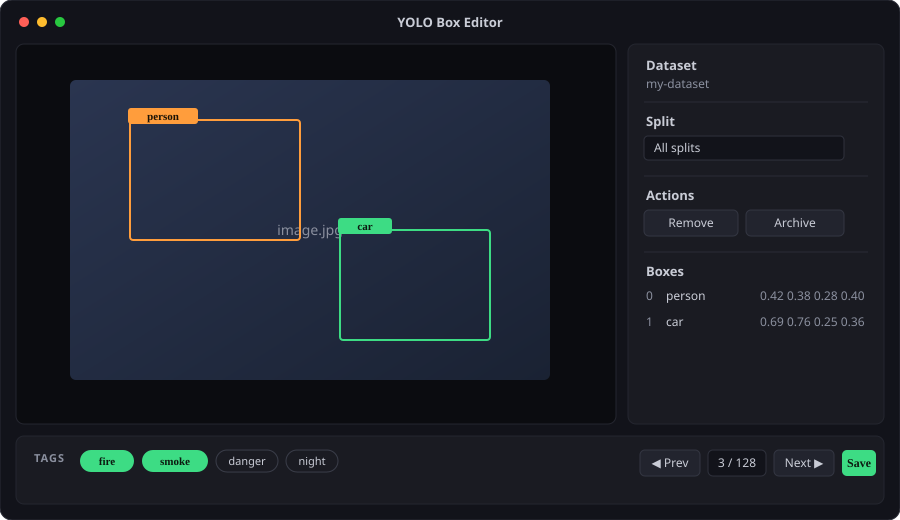
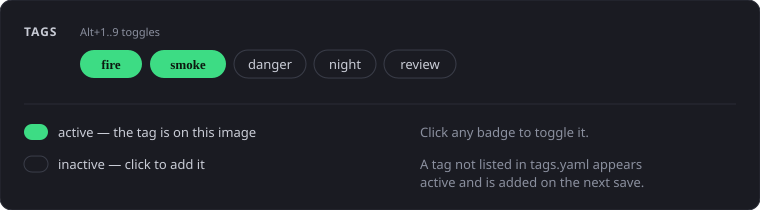

# yolo-box-editor

> **Simple · self-hosted · fast — draw and edit YOLO boxes with keyboard, mouse, or both.**

A small Flask-served web app for labelling images in
[YOLO](https://docs.ultralytics.com/datasets/detect/) format. No database, no
build step, no cloud account — point it at a `data.yaml` and start labelling.



Version **7.18.0** · [CHANGELOG.md](CHANGELOG.md) · [LICENSE](LICENSE) (MIT with a
non-commercial-use condition, no warranty) · new to labelling? Press **F1** in the
app (or start with [TUTORIAL.md](TUTORIAL.md)).

## Quick start

Install sets up an isolated `.venv`, adds the **`ybe`** command and starts the
app. The one-line bootstrap needs **Python 3** and either a shell or Python to
fetch the installer — pick whichever you have:

```sh
# 1. one-liner (sh) — curl only fetches a tiny bootstrap; the installer is Python
curl -fsSL https://raw.githubusercontent.com/tabebqena/yolo-box-editor/main/ybx.sh | sh -s -- install

# 2. download the Python installer and run it
curl -fsSL https://raw.githubusercontent.com/tabebqena/yolo-box-editor/main/ybx.py -o ybx.py
python3 ybx.py install

# 3. entirely from Python (no curl at all)
python3 -c "import urllib.request; open('ybx.py','wb').write(urllib.request.urlopen('https://raw.githubusercontent.com/tabebqena/yolo-box-editor/main/ybx.py').read())"
python3 ybx.py install

# 4. from a clone
git clone https://github.com/tabebqena/yolo-box-editor.git
cd yolo-box-editor
./ybx.sh install --from .        # or: python3 ybx.py install --from .

# then open http://127.0.0.1:5000 and paste the path to your data.yaml
```

**Windows** (PowerShell; installs to `%LOCALAPPDATA%\yolo-box-editor` and adds
`ybe` to your PATH — open a new terminal afterwards):

```powershell
# 5. bootstrap (PowerShell) — saves and runs the Python installer
irm https://raw.githubusercontent.com/tabebqena/yolo-box-editor/main/ybx.ps1 -OutFile ybx.ps1
.\ybx.ps1 install

# 6. or run the Python installer directly
py -3 -c "import urllib.request; open('ybx.py','wb').write(urllib.request.urlopen('https://raw.githubusercontent.com/tabebqena/yolo-box-editor/main/ybx.py').read())"
py -3 ybx.py install
```

> **Try it anywhere — new platforms welcome.** So far the app has been used on
> Debian-based Linux (Ubuntu/Debian). macOS and other Linux distributions
> (Fedora, Arch, Alpine, …) run the same code, and Windows support is brand new:
> it reuses that same, well-exercised Python core through Windows APIs. We just
> haven't had a Windows machine to try it on yet, so you might be the first.
> Nothing is hard to undo (`ybe uninstall` removes it cleanly), and a quick bug
> report if something misbehaves would be very welcome.

Already have Python? `pip install -r app/requirements.txt` then
`python app/app.py --data /path/to/data.yaml`.

Once installed, use the **`ybe`** command for everything:

```bash
ybe start --data /path/to/data.yaml   # run in the background
ybe stop        # stop it
ybe logs -f     # follow the log
ybe update      # update in place, keeping your files
ybe uninstall   # remove the app, keeping your files
```

Full details: [install, update and run](docs/install.md).

## What you can do

- **Draw and edit boxes** on the canvas: drag to draw, drag to move, drag a
  handle to resize. Boxes are stored as YOLO `.txt` labels next to the images.
- **A box list** beside the image shows every box with its class and
  `cx cy w h`; edit numbers by typing, or use `Tab` to move through the fields.
- **Navigate** with Prev/Next, the arrow keys, or type an image number to jump.
  `train` / `val` / `test` are selectable splits.
- **Filters** narrow the list to what a filter returns — stack up to 8 and run
  them top to bottom. See [filters](docs/filters.md).
- **Tags** mark an image with labels like `fire` or `danger`. The tag bar shows
  every tag; click one to toggle it. See [tags](docs/tags.md).
- **Undo / Redo / Save**, plus optional **auto-save** so navigation never asks.
- **Read-only mode** (`--readonly`) to browse a dataset safely.
- **Optional login** for a shared or LAN instance (off by default — a local
  install opens with no sign-in). Add an account with `ybe users --create NAME`;
  then Sign out and Change password live in **Settings → Account**, and
  `ybe users` lists the accounts. A convenience gate, not strong security — see
  [install](docs/install.md).
- **Arrange the UI**: put the panel left or right, and float or dock the Tags,
  Boxes, Actions, Navigation and Save widgets. The layout is remembered.
- **Custom actions and hooks**: run your own commands on the current image, or
  automatically on events like `after_save`. See
  [actions and hooks](docs/actions-and-hooks.md).
- **Custom widgets**: define your own dockable panel of buttons, dropdowns,
  checkboxes and text inputs in a `widgets/*.yaml` file. See
  [widgets](docs/widgets.md).
- **Extension packages**: group actions, hooks, filters and widgets into an
  `extensions/<name>/` folder, with its own Settings subtab. See
  [extension packages](docs/extensions.md).
- **Configurable shortcuts** in `shortcuts.txt`.
- **Built-in help** — a 3-level tutorial (Beginner / Intermediate / Expert) and
  task-focused **How to?** recipes, reachable with **F1** or the **?** button in
  the top panel.

## Keyboard cheat sheet

| Key | Does |
| --- | ---- |
| `F1` | open help / tutorials |
| `←` / `→` | previous / next image |
| `S` | save |
| `Z` / `Y` | undo / redo |
| `Delete` | delete selected box |
| `Esc` | drop just-drawn box / deselect |
| `/` | change the selected box's class |
| `Shift` | select the next box |
| `Tab` | cycle the selected row's fields |
| `F` | fix / unfix the selected box |
| `.` | hide / show boxes on the image |
| `,` | toggle box details (outlines only) |
| `I` | hide all boxes except the selected one |
| `Space` | focus the canvas (so shortcuts work after typing) |
| `Ctrl+A` | select all boxes |
| `Ctrl+←` / `→` / `↑` / `↓` | widen the selected box's matching border |
| `Ctrl+Shift+←` / `→` / `↑` / `↓` | narrow the selected box's matching border |
| `Alt+1`…`Alt+9` | toggle a tag by number |

**Ctrl+click** a box to add it to the selection (Ctrl+click again to remove it) —
the same works on a row in the Boxes list. Drag any selected box to move them all
together, or press `Delete` to remove them all; class changes and `F` apply to the
whole selection. `Ctrl`+drag still forces a new box inside/over an existing one.
Every action can be rebound in **Settings → Shortcuts → Edit** (or by hand in
`shortcuts.txt`); see [actions and hooks](docs/actions-and-hooks.md#built-in-app-actions).

## Tags at a glance

`tags.yaml` (beside `data.yaml`) lists the available tags; each image's tags are
stored in a `tags/` folder beside `images/` and `labels/`. Active tags are green,
inactive ones are outlined, and clicking toggles.



New tag names are added to `tags.yaml` when you save the image. If a tag seems
missing, see [Why can't I see my tag?](docs/tags.md#why-cant-i-see-my-tag).

## Further reading

- [TUTORIAL.md](TUTORIAL.md) — the 3-level tutorial (beginner → expert).
- [How to?](docs/howto.md) — task-focused recipes (also built into the app, `F1`).
- [install, update and run](docs/install.md) — installer, `ybe` commands, flags.
- [dataset, files and formats](docs/dataset.md) — `data.yaml`, label format, where files live.
- [actions and hooks](docs/actions-and-hooks.md) — custom commands and events.
- [widgets](docs/widgets.md) — custom dockable control panels.
- [extension packages](docs/extensions.md) — group extensions with a Settings subtab.
- [filters](docs/filters.md) — narrow the image list with scripts.
- [tags](docs/tags.md) — the tagging scheme and troubleshooting.
- [CHANGELOG.md](CHANGELOG.md) — what changed in each version.

## Development

A single Flask module (`app/app.py`) with a hand-rolled `data.yaml` parser (no
PyYAML needed to run). The UI is `app/templates/index.html` +
`app/static/app.js` + `app/static/style.css` and needs no build step. Behaviour
checks live in `tests/` and run with:

```bash
python -m pytest -q
```
